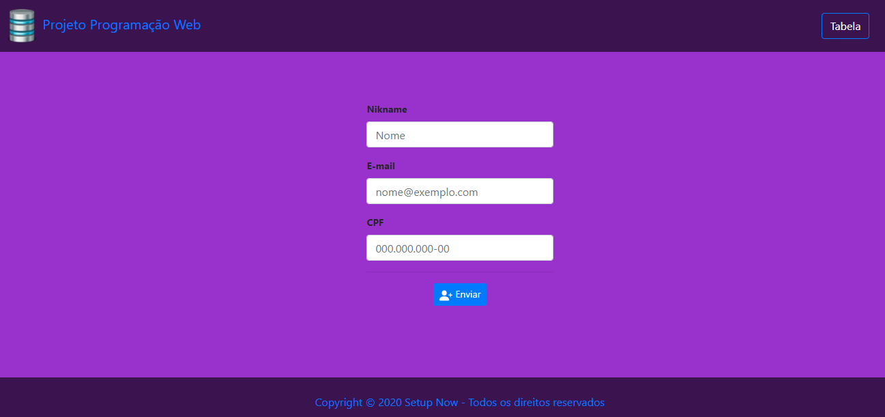

  <a href="http://mwrt.setupnow.com.br" align="center">
    
  </a>
 
</p>
<h1 align="center">
    
</h1>

<h4 align="center"> 
	🚧  Site para trabalho acadêmico 🚧
</h4>

<p align="center">
 <a href="#-sobre-o-projeto">Sobre</a> •
 <a href="#-funcionalidades">Funcionalidades</a> •
 <a href="#-layout">Layout</a> • 
 <a href="#-como-executar-o-projeto">Como executar</a> • 
 <a href="#-tecnologias">Tecnologias</a> •  
 <a href="#-autor">Autor</a> • 
 <a href="#user-content--licença">Licença</a>
</p>


## 💻 Sobre o projeto

🚧 Site dinâmico - Desenvolvido para complementar e armazenar dados referente ao jogo desenvolvido no 4º módulo no curso de ciência da computação, jogo desenvolvido utilizando a plataforma Godot.

---

## ⚙️ Funcionalidades

- [x] Conexão com banco de dados para obter informação dos dados referente ao jogo.
- [x] Campo com formulário.
- [x] Informações complementares no footer referente ao horário de atendimento.

---

## 🎨 Layout

### Web

<p align="center" style="display: flex; align-items: flex-start; justify-content: center;">
  
</p>

---

## 🚀 Como executar o projeto

Este projeto é divido em duas partes:
1. Backend
2. Frontend

💡Para a execução da aplicação precisa que o Backend esteja sendo executado para funcionar.

### Pré-requisitos

Antes de começar, para usar localmente você vai precisar ter instalado em sua máquina as seguintes ferramentas:
[Git](https://git-scm.com), [Xampp](https://www.apachefriends.org/pt_br/index.html)  
Além disto é bom ter um editor para trabalhar com o código como [VSCode](https://code.visualstudio.com/)

#### 🧭 Rodando a aplicação web (Frontend)

```bash

# Clone este repositório
$ git clone gh repo clone Weslley95/mwrt

# Acesse a pasta do projeto no seu terminal/cmd ou realize o donwload ZIP dos arquivos
$ cd mwrt

# Deixe a pasta alocada em xampp/htdocs e execute o Apache no xampp 

# A aplicação será aberta na porta:80 - acesse http://localhost

```

---

## 🛠 Tecnologias

As seguintes ferramentas foram usadas na construção do projeto:

#### **Website**

-   **[Bootstrap](https://getbootstrap.com/)**

#### **Server**

-   **[PHP](https://www.php.net/manual/pt_BR/intro-whatis.php)**


#### [](https://github.com/tgmarinho/Ecoleta#utilit%C3%A1rios)**Utilitários**

-   Editor:  **[Visual Studio Code](https://code.visualstudio.com/)**
-   Ícones:  **[Feather Icons](https://feathericons.com/)**,  **[Font Awesome](https://fontawesome.com/)**
-   Fontes:  **[Ubuntu](https://fonts.google.com/specimen/Ubuntu)**,  **[Roboto](https://fonts.google.com/specimen/Roboto)**

---

## 💪 Como contribuir para o projeto

1. Faça um **fork** do projeto.
2. Crie uma nova branch com as suas alterações: `git checkout -b my-feature`
3. Salve as alterações e crie uma mensagem de commit contando o que você fez: `git commit -m "feature: My new feature"`
4. Envie as suas alterações: `git push origin my-feature`

---

## 🦸 Autor

<a href="https://setupnow.com.br/portfolio.html#portifolio">
 
 <br />
 <sub><b>Weslley</b></sub></a> <a href="https://setupnow.com.br/portfolio.html#portifolio" title="Setup Now">🚀</a>
 <br />

[](https://www.linkedin.com/in/weslley-bezerra-451576125/) 
[](mailto:weslleybezerra95@gmail.com)

---

## 📝 Licença

Este projeto esta sobe a licença [MIT](./LICENSE).

Feito por Weslley 👋🏽 [Entre em contato!](https://www.linkedin.com/in/weslley-bezerra-451576125/)

---
